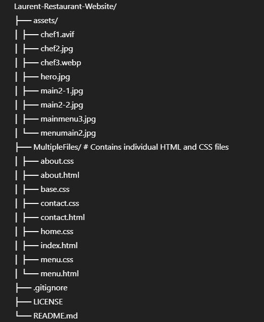

# Laurent-Restaurant-Website


A beautifully designed, responsive restaurant website for **Laurent**, offering an authentic Italian dining experience. This project showcases a multi-page layout (Home, Menu, About Us, Contact) built with **HTML** and **CSS**, focusing on modern aesthetics, user experience, and responsiveness across various devices.

---

## 🚀 Live Demo

👉 [Visit Live Site](https://uzairali12.github.io/Laurent-Restaurant-Website/)

---

## ✨ Features

### ✅ Home Page
- Captivating hero section with a call to action
- Highlights of the restaurant's unique selling points (authentic Italian, expert chefs, fresh ingredients)
- Chef's showcase section introducing the head chef
- Culinary artistry gallery showcasing signature dishes
- Restaurant ambiance section with key features
- Special offers and promotions
- Customer testimonials
- Reservation call-to-action

### ✅ Menu Page
- Comprehensive menu categorized into:
  - Appetizers
  - Soups & Salads
  - Pasta
  - Premium Steaks
  - Fresh Seafood
  - Continental Classics
  - Italian Mains
  - Risotto & Rice
  - Artisan Desserts
  - Beverages
- Clear pricing for each item
- Hover effects for menu items
- Chef's note for dietary information

### ✅ About Us Page
- Detailed story of the restaurant's founding and philosophy
- Core values (Quality Ingredients, Family Tradition, Community, Sustainability)
- "Meet Our Team" section with profiles of key staff members

### ✅ Contact Page
- Contact information (address, phone, email, hours)
- Private events and parking details
- Interactive contact form for inquiries and reservations
- Embedded Google Map
- Location details and landmarks

### ✅ Responsive Design
- Optimized for seamless viewing and interaction on desktops, tablets, and mobile devices using media queries

### ✅ Modern UI/UX
- Clean, elegant design with smooth transitions, hover effects, and intuitive navigation

### ✅ Semantic HTML5
- Well-structured and accessible HTML for better SEO and maintainability

### ✅ CSS3 Styling
- Custom CSS with gradients, shadows, and responsive layouts (Flexbox and Grid)

---

## 🛠️ Technologies Used

- **HTML5** – For structuring the content
- **CSS3** – For styling and layout, including responsive design

---

## 📂 Project Structure




---

## 💻 Installation and Setup

To run this project locally:

1. **Clone the repository:**
```bash
   git clone https://github.com/uzairali12/Laurent-Restaurant-Website.git
```
2. Navigate to the project directory:
```
cd Laurent-Restaurant-Website
```
3. Open the website:
Open MultipleFiles/index.html in your browser

---
## 🤝 Contributing
Contributions are welcome! Here's how to contribute:

1. Fork the repository
2.Create a new branch
```
git checkout -b feature/YourFeature
```
3. Make your changes
4. Commit your changes
```
git commit -m "Add Your Feature"
```
5. Push to your branch
```
git push origin feature/YourFeature
```
6. Open a Pull Request
---
## 📄 License
This project is licensed under the MIT License – see the [LICENSE](LICENSE) file for details.

