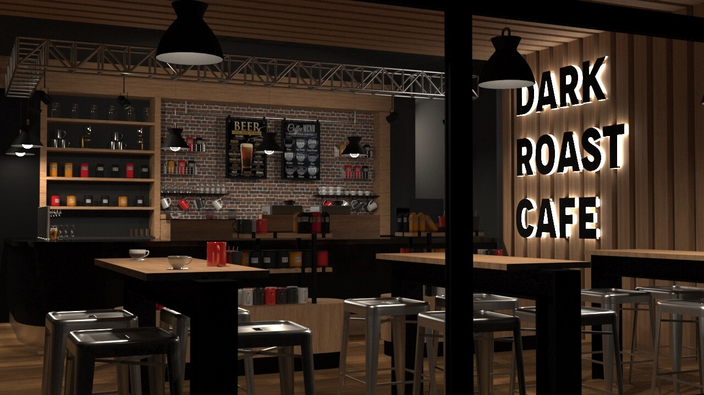

<!DOCTYPE html>
<html lang="en">
<head>
    <meta charset="UTF-8">
    <meta name="viewport" content="width=device-width, initial-scale=1.0">
    <title>README - Laurent Restaurant Website</title>
    
</head>
<body>
    <h1>Laurent-Restaurant-Website</h1>

    

    
A beautifully designed, responsive restaurant website for "Laurent," offering an authentic Italian dining experience. This project showcases a multi-page layout (Home, Menu, About Us, Contact) built with HTML and CSS, focusing on modern aesthetics, user experience, and responsiveness across various devices.

    <h2>🚀 Live Demo</h2>

    
Explore the live website here: <a href="https://uzairali12.github.io/Laurent-Restaurant-Website/">https://uzairali12.github.io/Laurent-Restaurant-Website/</a>

    <h2>✨ Features</h2>

    <ul>
        <li><strong>Home Page:</strong>
            <ul>
                <li>Captivating hero section with a call to action.</li>
                <li>Highlights of the restaurant's unique selling points (authentic Italian, expert chefs, fresh ingredients).</li>
                <li>Chef's showcase section introducing the head chef.</li>
                <li>Culinary artistry gallery showcasing signature dishes.</li>
                <li>Restaurant ambiance section with key features.</li>
                <li>Special offers and promotions.</li>
                <li>Customer testimonials.</li>
                <li>Reservation call-to-action.</li>
            </ul>
        </li>
        <li><strong>Menu Page:</strong>
            <ul>
                <li>Comprehensive menu categorized into Appetizers, Soups & Salads, Pasta, Premium Steaks, Fresh Seafood, Continental Classics, Italian Mains, Risotto & Rice, Artisan Desserts, and Beverages.</li>
                <li>Clear pricing for each item.</li>
                <li>Hover effects for menu items.</li>
                <li>Chef's note for dietary information.</li>
            </ul>
        </li>
        <li><strong>About Us Page:</strong>
            <ul>
                <li>Detailed story of the restaurant's founding and philosophy.</li>
                <li>Core values of the restaurant (Quality Ingredients, Family Tradition, Community, Sustainability).</li>
                <li>"Meet Our Team" section with profiles of key staff members.</li>
            </ul>
        </li>
        <li><strong>Contact Page:</strong>
            <ul>
                <li>Contact information (address, phone, email, hours).</li>
                <li>Private events and parking details.</li>
                <li>Interactive contact form for inquiries and reservations.</li>
                <li>Embedded Google Map for easy location finding.</li>
                <li>Location details and landmarks.</li>
            </ul>
        </li>
        <li><strong>Responsive Design:</strong> Optimized for seamless viewing and interaction on desktops, tablets, and mobile devices using media queries.</li>
        <li><strong>Modern UI/UX:</strong> Clean, elegant design with smooth transitions, hover effects, and intuitive navigation.</li>
        <li><strong>Semantic HTML5:</strong> Well-structured and accessible HTML for better SEO and maintainability.</li>
        <li><strong>CSS3 Styling:</strong> Custom CSS for all visual elements, including gradients, shadows, and responsive layouts (Flexbox and Grid).</li>
    </ul>

    <h2>🛠️ Technologies Used</h2>

    <ul>
        <li><strong>HTML5:</strong> For structuring the content.</li>
        <li><strong>CSS3:</strong> For styling and layout, including responsive design.</li>
    </ul>

    <h2>📂 Project Structure</h2>

    <pre><code>Laurent-Restaurant-Website/
├── assets/
│   ├── chef1.avif
│   ├── chef2.jpg
│   ├── chef3.webp
│   ├── hero.jpg
│   ├── main2-1.jpg
│   ├── main2-2.jpg
│   ├── mainmenu3.jpg
│   └── menumain2.jpg
├── MultipleFiles/ (Contains individual HTML and CSS files for better organization)
│   ├── about.css
│   ├── about.html
│   ├── base.css
│   ├── contact.css
│   ├── contact.html
│   ├── home.css
│   ├── index.html
│   ├── menu.css
│   └── menu.html
├── .gitignore
├── LICENSE
└── README.md
</code></pre>

    <h2>💻 Installation and Setup</h2>

    
To run this project locally, follow these steps:

    <ol>
        <li><strong>Clone the repository:</strong>
            <pre><code>git clone https://github.com/uzairali12/Laurent-Restaurant-Website.git</code></pre>
        </li>
        <li><strong>Navigate to the project directory:</strong>
            <pre><code>cd Laurent-Restaurant-Website</code></pre>
        </li>
        <li><strong>Open the <code>index.html</code> file:</strong>
            
You can simply open the <code>index.html</code> file located in the <code>MultipleFiles</code> directory in your web browser.

        </li>
    </ol>

    <h2>🤝 Contributing</h2>

    
Contributions are welcome! If you have suggestions for improvements or new features, please feel free to:

    <ol>
        <li>Fork the repository.</li>
        <li>Create a new branch (<code>git checkout -b feature/YourFeature</code>).</li>
        <li>Make your changes.</li>
        <li>Commit your changes (<code>git commit -m 'Add some feature'</code>).</li>
        <li>Push to the branch (<code>git push origin feature/YourFeature</code>).</li>
        <li>Open a Pull Request.</li>
    </ol>

    <h2>📄 License</h2>

    
This project is licensed under the MIT License - see the <a href="LICENSE">LICENSE</a> file for details.

    <h2>📧 Contact</h2>

    
For any inquiries or feedback, please reach out to:

    <ul>
        <li><strong>Muhammad Uzair Ali</strong></li>
        <li><strong>Email:</strong> info@laurent.com (Placeholder)</li>
    </ul>

    

    
<strong>Thank you for checking out the Laurent Restaurant Website!</strong>

</body>
</html>
